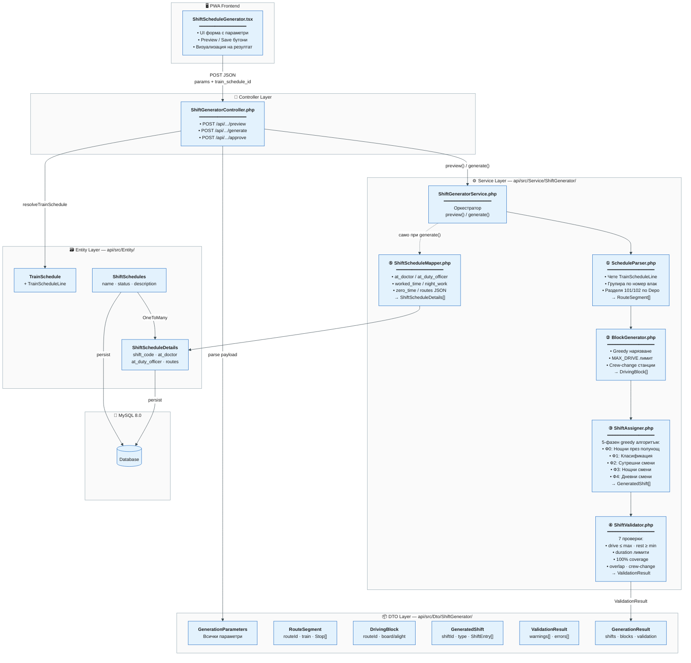

```mermaid 
%%{init: {'theme': 'base', 'themeVariables': {'primaryColor': '#E3F2FD', 'primaryTextColor': '#1A1A1A', 'primaryBorderColor': '#1565C0', 'lineColor': '#37474F', 'secondaryColor': '#FFF3E0', 'tertiaryColor': '#E8F5E9', 'background': '#FFFFFF', 'mainBkg': '#E3F2FD', 'nodeBorder': '#1565C0', 'clusterBkg': '#FAFAFA', 'clusterBorder': '#90A4AE', 'titleColor': '#212121', 'edgeLabelBackground': '#FFFFFF', 'fontSize': '14px'}}}%%
flowchart TB
    subgraph Frontend["🖥️ PWA Frontend"]
        UI["<b>ShiftScheduleGenerator.tsx</b>\n━━━━━━━━━━━━━━━━━━\n• UI форма с параметри\n• Preview / Save бутони\n• Визуализация на резултат"]
    end

    subgraph Controller["📡 Controller Layer"]
        SC["<b>ShiftGeneratorController.php</b>\n━━━━━━━━━━━━━━━━━━\n• POST /api/.../preview\n• POST /api/.../generate\n• POST /api/.../approve"]
    end

    subgraph Pipeline["⚙️ Service Layer — api/src/Service/ShiftGenerator/"]
        direction TB
        SGS["<b>ShiftGeneratorService.php</b>\n━━━━━━━━━━━━━━━━━━\nОркестратор\npreview() / generate()"]

        SP["<b>① ScheduleParser.php</b>\n━━━━━━━━━━━━━━━━━━\n• Чете TrainScheduleLine\n• Групира по номер влак\n• Разделя 101/102 по Depo\n→ RouteSegment[]"]

        BG["<b>② BlockGenerator.php</b>\n━━━━━━━━━━━━━━━━━━\n• Greedy нарязване\n• MAX_DRIVE лимит\n• Crew-change станции\n→ DrivingBlock[]"]

        SA["<b>③ ShiftAssigner.php</b>\n━━━━━━━━━━━━━━━━━━\n5-фазен greedy алгоритъм:\n• Ф0: Нощни през полунощ\n• Ф1: Класификация\n• Ф2: Сутрешни смени\n• Ф3: Нощни смени\n• Ф4: Дневни смени\n→ GeneratedShift[]"]

        SV["<b>④ ShiftValidator.php</b>\n━━━━━━━━━━━━━━━━━━\n7 проверки:\n• drive ≤ max · rest ≥ min\n• duration лимити\n• 100% coverage\n• overlap · crew-change\n→ ValidationResult"]

        SM["<b>⑤ ShiftScheduleMapper.php</b>\n━━━━━━━━━━━━━━━━━━\n• at_doctor / at_duty_officer\n• worked_time / night_work\n• zero_time / routes JSON\n→ ShiftScheduleDetails[]"]
    end

    subgraph DTOs["📦 DTO Layer — api/src/Dto/ShiftGenerator/"]
        GP["<b>GenerationParameters</b>\nВсички параметри"]
        RS["<b>RouteSegment</b>\nrouteId · train · Stop[]"]
        DB["<b>DrivingBlock</b>\nrouteId · board/alight"]
        GS["<b>GeneratedShift</b>\nshiftId · type · ShiftEntry[]"]
        VR["<b>ValidationResult</b>\nwarnings[] · errors[]"]
        GR["<b>GenerationResult</b>\nshifts · blocks · validation"]
    end

    subgraph Entities["🗃️ Entity Layer — api/src/Entity/"]
        TS["<b>TrainSchedule</b>\n+ TrainScheduleLine"]
        SS["<b>ShiftSchedules</b>\nname · status · description"]
        SSD["<b>ShiftScheduleDetails</b>\nshift_code · at_doctor\nat_duty_officer · routes"]
    end

    subgraph Database["💾 MySQL 8.0"]
        MYSQL[("Database")]
    end

    UI -->|"POST JSON\nparams + train_schedule_id"| SC
    SC -->|"parse payload"| GP
    SC -->|"resolveTrainSchedule"| TS
    SC -->|"preview() / generate()"| SGS

    SGS --> SP
    SP --> BG
    BG --> SA
    SA --> SV
    SV -->|"ValidationResult"| GR

    SGS -.->|"само при generate()"| SM
    SM --> SSD

    SS -->|"OneToMany"| SSD
    SSD -->|"persist"| MYSQL
    SS -->|"persist"| MYSQL
```